# hairsalon

hairsalon gem - make your own (pixel) women's punk hair style incl. mohawk, wild & crazy, short & long, and much more with your own hair colors incl white, silver, blonde, pink, purple, red and much more  


* home  :: [github.com/cryptopunksnotdead/punkart.sandbox](https://github.com/cryptopunksnotdead/punkart.sandbox)
* bugs  :: [github.com/cryptopunksnotdead/punkart.sandbox/issues](https://github.com/cryptopunksnotdead/punkart.sandbox/issues)
* gem   :: [rubygems.org/gems/hairsalon](https://rubygems.org/gems/hairsalon)
* rdoc  :: [rubydoc.info/gems/hairsalon](http://rubydoc.info/gems/hairsalon)


## Usage


### Hair Colors

For now the hair colors include:

- 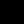 black - #000000 / rgb(  0   0   0) - hsl(  0°   0%   0%) - hsv(  0°   0%   0%)          
- 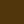 brown - #51360c / rgb( 81  54  12) - hsl( 37°  74%  18%) - hsv( 37°  85%  32%)
- 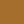 brunette - #a66e2c / rgb(166 110  44) - hsl( 32°  58%  41%) - hsv( 32°  73%  65%)
-  orange - #e65700 / rgb(230  87   0) - hsl( 23° 100%  45%) - hsv( 23° 100%  90%)
-  red - #e22626 / rgb(226  38  38) - hsl(  0°  76%  52%) - hsv(  0°  83%  89%)
- 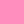 pink - #ff8ebe / rgb(255 142 190) - hsl(335° 100%  78%) - hsv(335°  44% 100%)
- 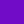 purple - #710cc7 / rgb(113  12 199) - hsl(272°  89%  41%) - hsv(272°  94%  78%)
-  green - #28b143 / rgb( 40 177  67) - hsl(132°  63%  43%) - hsv(132°  77%  69%)
- 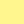 blonde - #fff68e / rgb(255 246 142) - hsl( 55° 100%  78%) - hsv( 55°  44% 100%)
-  silver - #e0e0e0 / rgb(224 224 224) - hsl(  0°   0%  88%) - hsv(  0°   0%  88%)       
-  white - #ffffff / rgb(255 255 255) - hsl(  0°   0% 100%) - hsv(  0°   0% 100%)          


### Hair Styles

The hair styles include:

- afro 
- big 
- bob 
- bob2 
- bob3 
- buzzcut 
- clown 
- clown2 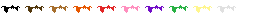
- crazy 
- crazy2 
- crazy3 
- frumpy 
- halfshaved 
- halfshaved2 
- halfshaved3 
- heart 
- longcurly 
- messy 
- mohawk 
- mohawk2 
- mohawkthin 
- peakspike 
- peakspike2 
- pigtails 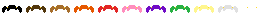
- pigtails2 
- pigtails3 
- pixie 
- short 
- short2 
- side 
- side2 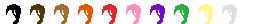
- spiky 
- straight 
- straight2 
- straight3 
- stringy 
- vampire 
- vampire2 
- wild 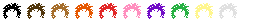
- wild2 
- wild3 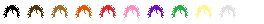
- wild4 
- wild5 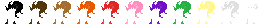


plus (no color - alpha channel only)

- shavedhead 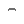


### How To Make Hair Styles


Use the make method - pass in the hair style and optional the color (default is black) -
and get the hair (pixel art) image attribute (in 24x24px).

``` ruby
require 'hairsalon'

hair =  Hairsalon::Hair.make( 'Buzz Cut' )
hair.save( "./buzzcut-black.png" )
hair.zoom(4).save( "./buzzcut-black@4x.png" )

hair =  Hairsalon::Hair.make( 'Pigtails', color: 'Green' )
hair.save( "./pigtails-green.png" )
hair.zoom(4).save( "./pigtails-green@4x.png" )

hair =  Hairsalon::Hair.make( 'Wild', color: 'Blonde' )
hair.save( "./wild-blonde.png" )
hair.zoom(4).save( "./wild-blonde@4x.png" )
```


resulting in:


4x

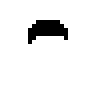
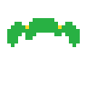
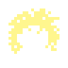


That's it for now.


## Questions? Comments?

Join us in the [Punk Art discord (chat server)](https://discord.gg/FE3HeXNKRa). Yes you can.
Your questions and commentary welcome.

Or post them over at the [Help & Support](https://github.com/geraldb/help) page. Thanks.


