# punk maker

punkmaker gem - make your own (pixel) punk base (archetype) heads incl. humans, zombies, apes, aliens, mummies, robots, and much more


* home  :: [github.com/cryptopunksnotdead/punkart.sandbox](https://github.com/cryptopunksnotdead/punkart.sandbox)
* bugs  :: [github.com/cryptopunksnotdead/punkart.sandbox/issues](https://github.com/cryptopunksnotdead/punkart.sandbox/issues)
* gem   :: [rubygems.org/gems/punkmaker](https://rubygems.org/gems/punkmaker)
* rdoc  :: [rubydoc.info/gems/punkmaker](http://rubydoc.info/gems/punkmaker)


## Usage

Let's make golden punks...

``` ruby
require 'punkmaker'

GOLD  =  '#ffd700'

###
# humans
punk_m = Punk::Human.make( GOLD,  gender: 'm' )
punk_m.save( 'human-male_gold.png' )
punk_m.zoom(4).save( 'human-male_gold@4x.png' )

punk_f = Punk::Human.make( GOLD, gender: 'f' )
punk_f.save( 'human-female_gold.png' )
punk_f.zoom(4).save( 'human-female_gold@4x.png' )
```


Voila!


4x


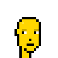


Let's try some more base (arche)types:

``` ruby
types = [
  Punk::Mummy,
  Punk::Alien, 
  Punk::Ape,
  Punk::Skeleton,
  Punk::Zombie,
  Punk::Demon,
  Punk::Orc,
  Punk::Robot,
  Punk::Vampire,   
]

types.each do |type|
    ## get last name e.g. Orc from Punk::Orc
    name = type.name.split('::')[-1].downcase
  
    punk_m = type.make( GOLD, gender: 'm' )
    punk_m.save( "#{name}-male_gold.png" )
    punk_m.zoom(4).save( "#{name}-male_gold@4x.png" )

    punk_f = type.make( GOLD, gender: 'f' )
    punk_f.save( "#{name}-female_gold.png" )
    punk_f.zoom(4).save( "#{name}-female_gold@4x.png" )
end
```

Voila!

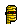 
 
 
 
 
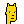 
 
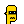 
  <br>
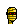
 
 
 
 
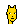 
 
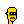 


4x

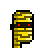 
 
 
 
 
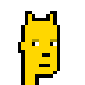 
 
 
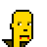  <br>
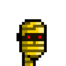
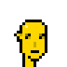 
 
 
 
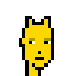 
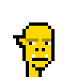 
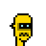 
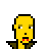


Let's try some more colors:

```ruby
NEONGREEN     =  '#c3ff00'
DEEPPINK      =  '#ff1493'
DEEPPURPLE    =  '#aa4399'


colors = {
  'green'  =>  NEONGREEN,
  'pink'   =>  DEEPPINK,
  'purple' =>  DEEPPURPLE,
}

types = [Punk::Human]+types  ## add human first

types.each do |type|
    ## get last name e.g. Orc from Punk::Orc
    name = type.name.split('::')[-1].downcase
    colors.each do |color_name, color|  
      punk_m = type.make( color, gender: 'm' )
      punk_m.save( "#{name}-male_#{color_name}.png" )
      punk_m.zoom(4).save( "#{name}-male_#{color_name}@4x.png" )

      punk_f = type.make( color, gender: 'f' )
      punk_f.save( "#{name}-female_#{color_name}.png" )
      punk_f.zoom(4).save( "#{name}-female_#{color_name}@4x.png" )
    end
end
```

Voila!

 
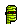 
 
 
 
 
 
 
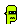 
  <br>


 
 
 
 
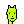 
 
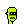 
 <br>
 
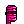 
 
 
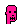 
 
 
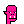 
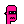 
  <br>

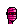
 
 
 
 
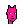 
 
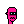 
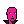 <br>
 
 
 
 
 
 
 
 
 
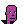  <br>

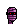
 
 
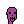 
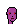 
 
 
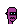 
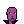 


4x

 
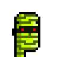 
 
 
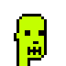 
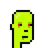 
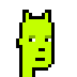 
 
 
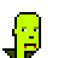  <br>
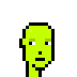
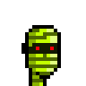
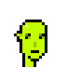 
 
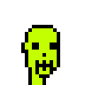 
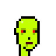 
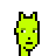 
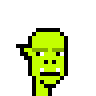 
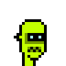 
 <br>
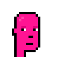 
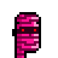 
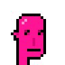 
 
 
 
 
 
 
  <br>


 
 
 
 
 
 
 
 <br>
 
 
 
 
 
 
 
 
 
  <br>


 
 
 
 
 
 
 
 


That's it.


## License

The scripts are dedicated to the public domain.
Use it as you please with no restrictions whatsoever.


## Questions? Comments?

Join us in the [Punk Art discord (chat server)](https://discord.gg/FE3HeXNKRa). Yes you can.
Your questions and commentary welcome.

Or post them over at the [Help & Support](https://github.com/geraldb/help) page. Thanks.


