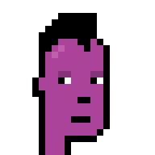
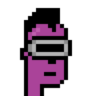
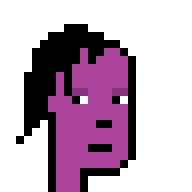
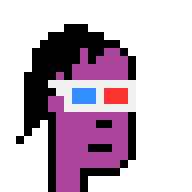
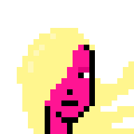
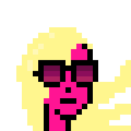
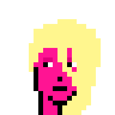
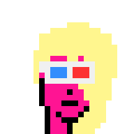

# punk me

punkme gem - generate your own (pixel) punk characters / heads - using your own skintone, eye color, hair & hair color, and much more


* home  :: [github.com/cryptopunksnotdead/punkart.sandbox](https://github.com/cryptopunksnotdead/punkart.sandbox)
* bugs  :: [github.com/cryptopunksnotdead/punkart.sandbox/issues](https://github.com/cryptopunksnotdead/punkart.sandbox/issues)
* gem   :: [rubygems.org/gems/punkme](https://rubygems.org/gems/punkme)
* rdoc  :: [rubydoc.info/gems/punkme](http://rubydoc.info/gems/punkme)


## Usage


Let's try purple punks...

```ruby
require 'punkme'

PURPLE =  '#AA4399'
 
punk = Punkme::Image.generate( skintone: PURPLE,
                                gender: 'm',
                                hair: 'mohawkbig' )
punk.save( "./purple.png")
punk.zoom(8).save( "./purple@8x.png")

## let's add virtual reality (VR) headset
punkb = punk.add( 'VR' )
punkb.save( "./purple-ii.png")
punkb.zoom(8).save( "./purple-ii@8x.png")


## let's try a different hair style
punk = Punkme::Image.generate( skintone: PURPLE,
                                 gender: 'm',
                                 hair: 'halfshaved' )
punk.save( "./tmp/purple2.png")
punk.zoom(8).save( "./tmp/purple2@8x.png")

# let's try different accessory 
punkb = punk.add( '3D Glasses' )
punkb.save( "./purple2-ii.png")
punkb.zoom(8).save( "./purple2-ii@8x.png")
```

resulting in


8x







Let's try deep pink "barbie" punk(ette)s...

```ruby
DEEP_PINK = '#ff1493'

punk = Punkme::Image.generate( skintone: DEEP_PINK ,
                                 gender: 'f',
                                 hair: 'straight3',
                                 hair_color: 'blonde' )
punk.save( "./pink.png")
punk.zoom(8).save( "./pink@8x.png")

punkb = punk.add( 'Big Shades' )
punkb.save( "./pink-ii.png")
punkb.zoom(8).save( "./pink-ii@8x.png")


punk = Punkme::Image.generate( skintone: DEEP_PINK ,
                                 gender: 'f',
                                 hair: 'side2',
                                 hair_color: 'blonde' )
punk.save( "./pink2.png")
punk.zoom(8).save( "./pink2@8x.png")

punkb = punk.add( '3D Glasses' )
punkb.save( "./pink2-ii.png")
punkb.zoom(8).save( "./pink2-ii@8x.png")
```

resulting in


8x







Q: What hair styles (and colors) can I use?

For men's [see the barbershop »](../barbershop) <br>
For women's [see the hairsalon »](../hairsalon) 


That's it.


## License

The scripts are dedicated to the public domain.
Use it as you please with no restrictions whatsoever.


## Questions? Comments?

Join us in the [Punk Art discord (chat server)](https://discord.gg/FE3HeXNKRa). Yes you can.
Your questions and commentary welcome.

Or post them over at the [Help & Support](https://github.com/geraldb/help) page. Thanks.


