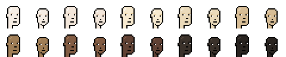
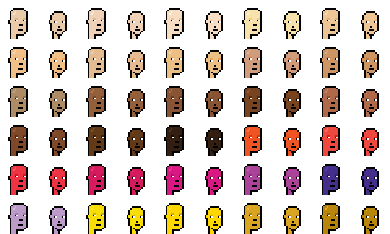
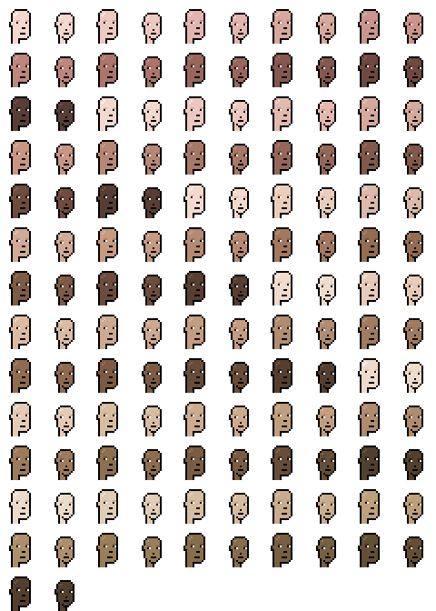

# Skin Tone (Colors & Research)  - Beyond (Four Scale 1/2/3/4) Dark, Medium / Mid, Light, Albino

## ye_olde_punks (4 skin tones)

Names | Color  | HEX, RGB, HSL, HSV
------|--------|---------
dark • 1 |  | #713f1d / rgb(113  63  29) - hsl( 24°  59%  28%) - hsv( 24°  74%  44%)
medium • mid • 2 |  | #ae8b61 / rgb(174 139  97) - hsl( 33°  32%  53%) - hsv( 33°  44%  68%)
light • 3 |  | #dbb180 / rgb(219 177 128) - hsl( 32°  56%  68%) - hsv( 32°  42%  86%)
albino • 4 |  | #ead9d9 / rgb(234 217 217) - hsl(  0°  29%  88%) - hsv(  0°   7%  92%)

## dr_ellis_monk (10 skin tones)

Names | Color  | HEX, RGB, HSL, HSV
------|--------|---------
01 • MST 01 • monk 01 |  | #f6ede4 / rgb(246 237 228) - hsl( 30°  50%  93%) - hsv( 30°   7%  96%)
02 • MST 02 • monk 02 |  | #f3e7db / rgb(243 231 219) - hsl( 30°  50%  91%) - hsv( 30°  10%  95%)
03 • MST 03 • monk 03 |  | #f7ead0 / rgb(247 234 208) - hsl( 40°  71%  89%) - hsv( 40°  16%  97%)
04 • MST 04 • monk 04 |  | #eadaba / rgb(234 218 186) - hsl( 40°  53%  82%) - hsv( 40°  21%  92%)
05 • MST 05 • monk 05 |  | #d7bd96 / rgb(215 189 150) - hsl( 36°  45%  72%) - hsv( 36°  30%  84%)
06 • MST 06 • monk 06 |  | #a07e56 / rgb(160 126  86) - hsl( 32°  30%  48%) - hsv( 32°  46%  63%)
07 • MST 07 • monk 07 |  | #825c43 / rgb(130  92  67) - hsl( 24°  32%  39%) - hsv( 24°  48%  51%)
08 • MST 08 • monk 08 |  | #604134 / rgb( 96  65  52) - hsl( 18°  30%  29%) - hsv( 18°  46%  38%)
09 • MST 09 • monk 09 |  | #3a312a / rgb( 58  49  42) - hsl( 26°  16%  20%) - hsv( 26°  28%  23%)
10 • MST 10 • monk 10 |  | #292420 / rgb( 41  36  32) - hsl( 27°  12%  14%) - hsv( 27°  22%  16%)

## punks_not_dead (30 skin tones)

Names | Color  | HEX, RGB, HSL, HSV
------|--------|---------
ivory |  | #e9cba9 / rgb(233 203 169) - hsl( 32°  59%  79%) - hsv( 32°  27%  91%)
porcelain |  | #efd1b7 / rgb(239 209 183) - hsl( 28°  64%  83%) - hsv( 28°  23%  94%)
pale ivory |  | #f7ddc2 / rgb(247 221 194) - hsl( 31°  77%  86%) - hsv( 31°  21%  97%)
warm ivory |  | #f7e2ab / rgb(247 226 171) - hsl( 43°  83%  82%) - hsv( 43°  31%  97%)
sand |  | #eec695 / rgb(238 198 149) - hsl( 33°  72%  76%) - hsv( 33°  37%  93%)
rose beige |  | #f1c088 / rgb(241 192 136) - hsl( 32°  79%  74%) - hsv( 32°  44%  95%)
limestone |  | #e5bb91 / rgb(229 187 145) - hsl( 30°  62%  73%) - hsv( 30°  37%  90%)
beige |  | #ecbf84 / rgb(236 191 132) - hsl( 34°  73%  72%) - hsv( 34°  44%  93%)
sienna |  | #d19c7c / rgb(209 156 124) - hsl( 23°  48%  65%) - hsv( 23°  41%  82%)
honey |  | #cd9564 / rgb(205 149 100) - hsl( 28°  51%  60%) - hsv( 28°  51%  80%)
band |  | #ad8b65 / rgb(173 139 101) - hsl( 32°  31%  54%) - hsv( 32°  42%  68%)
almond |  | #94603b / rgb(148  96  59) - hsl( 25°  43%  41%) - hsv( 25°  60%  58%)
chestnut |  | #895434 / rgb(137  84  52) - hsl( 23°  45%  37%) - hsv( 23°  62%  54%)
bronze |  | #78441f / rgb(120  68  31) - hsl( 25°  59%  30%) - hsv( 25°  74%  47%)
umber |  | #b06949 / rgb(176 105  73) - hsl( 19°  41%  49%) - hsv( 19°  59%  69%)
golden |  | #7f4829 / rgb(127  72  41) - hsl( 22°  51%  33%) - hsv( 22°  68%  50%)
espresso |  | #623a17 / rgb( 98  58  23) - hsl( 28°  62%  24%) - hsv( 28°  77%  38%)
chocolate |  | #321f11 / rgb( 50  31  17) - hsl( 25°  49%  13%) - hsv( 25°  66%  20%)
orange |  | #f05423 / rgb(240  84  35) - hsl( 14°  87%  54%) - hsv( 14°  85%  94%)
warm red |  | #ef483e / rgb(239  72  62) - hsl(  3°  85%  59%) - hsv(  3°  74%  94%)
red |  | #ee3342 / rgb(238  51  66) - hsl(355°  85%  57%) - hsv(355°  79%  93%)
rubine red |  | #d51b5e / rgb(213  27  94) - hsl(338°  78%  47%) - hsv(338°  87%  84%)
pink • barbie pink |  | #da1884 / rgb(218  24 132) - hsl(327°  80%  47%) - hsv(327°  89%  85%)
purple |  | #aa4399 / rgb(170  67 153) - hsl(310°  43%  46%) - hsv(310°  61%  67%)
blue |  | #462e8d / rgb( 70  46 141) - hsl(255°  51%  37%) - hsv(255°  67%  55%)
violet |  | #bc9bc9 / rgb(188 155 201) - hsl(283°  30%  70%) - hsv(283°  23%  79%)
yellow |  | #f8de08 / rgb(248 222   8) - hsl( 54°  94%  50%) - hsv( 54°  97%  97%)
gold 1 • gold |  | #ffd700 / rgb(255 215   0) - hsl( 51° 100%  50%) - hsv( 51° 100% 100%)
gold 2 • goldenrod |  | #daa520 / rgb(218 165  32) - hsl( 43°  74%  49%) - hsv( 43°  85%  85%)
gold 3 • darkgoldenrod |  | #b8860b / rgb(184 134  11) - hsl( 43°  89%  38%) - hsv( 43°  94%  72%)

## color_me_human (66 skin tones)

Names | Color  | HEX, RGB, HSL, HSV
------|--------|---------
A1 |  | #f5d7cd / rgb(245 215 205) - hsl( 15°  67%  88%) - hsv( 15°  16%  96%)
A2 |  | #eec9c0 / rgb(238 201 192) - hsl( 12°  58%  84%) - hsv( 12°  19%  93%)
A3 |  | #e2b6af / rgb(226 182 175) - hsl(  8°  47%  79%) - hsv(  8°  23%  89%)
A4 |  | #d7a89c / rgb(215 168 156) - hsl( 12°  42%  73%) - hsv( 12°  27%  84%)
A5 |  | #ca958c / rgb(202 149 140) - hsl(  9°  37%  67%) - hsv(  9°  31%  79%)
A6 |  | #bd877b / rgb(189 135 123) - hsl( 11°  33%  61%) - hsv( 11°  35%  74%)
A7 |  | #ab756a / rgb(171 117 106) - hsl( 10°  28%  54%) - hsv( 10°  38%  67%)
A8 |  | #99675a / rgb(153 103  90) - hsl( 12°  26%  48%) - hsv( 12°  41%  60%)
A9 |  | #86574f / rgb(134  87  79) - hsl(  9°  26%  42%) - hsv(  9°  41%  53%)
A10 |  | #6f4940 / rgb(111  73  64) - hsl( 11°  27%  34%) - hsv( 11°  42%  44%)
A11 |  | #593d37 / rgb( 89  61  55) - hsl( 11°  24%  28%) - hsv( 11°  38%  35%)
B1 |  | #f3d8ce / rgb(243 216 206) - hsl( 16°  61%  88%) - hsv( 16°  15%  95%)
B2 |  | #edc8be / rgb(237 200 190) - hsl( 13°  57%  84%) - hsv( 13°  20%  93%)
B3 |  | #e3b9ac / rgb(227 185 172) - hsl( 14°  50%  78%) - hsv( 14°  24%  89%)
B4 |  | #d5a99b / rgb(213 169 155) - hsl( 14°  41%  72%) - hsv( 14°  27%  84%)
B5 |  | #c89784 / rgb(200 151 132) - hsl( 17°  38%  65%) - hsv( 17°  34%  78%)
B6 |  | #b88773 / rgb(184 135 115) - hsl( 17°  33%  59%) - hsv( 17°  38%  72%)
B7 |  | #a77865 / rgb(167 120 101) - hsl( 17°  27%  53%) - hsv( 17°  40%  65%)
B8 |  | #956759 / rgb(149 103  89) - hsl( 14°  25%  47%) - hsv( 14°  40%  58%)
B9 |  | #815949 / rgb(129  89  73) - hsl( 17°  28%  40%) - hsv( 17°  43%  51%)
B10 |  | #6f4b3e / rgb(111  75  62) - hsl( 16°  28%  34%) - hsv( 16°  44%  44%)
B11 |  | #583d32 / rgb( 88  61  50) - hsl( 17°  28%  27%) - hsv( 17°  43%  35%)
C1 |  | #f4dacd / rgb(244 218 205) - hsl( 20°  64%  88%) - hsv( 20°  16%  96%)
C2 |  | #eacdbb / rgb(234 205 187) - hsl( 23°  53%  83%) - hsv( 23°  20%  92%)
C3 |  | #dcb9a9 / rgb(220 185 169) - hsl( 19°  42%  76%) - hsv( 19°  23%  86%)
C4 |  | #d0aa95 / rgb(208 170 149) - hsl( 21°  39%  70%) - hsv( 21°  28%  82%)
C5 |  | #c69b81 / rgb(198 155 129) - hsl( 23°  38%  64%) - hsv( 23°  35%  78%)
C6 |  | #b68a70 / rgb(182 138 112) - hsl( 22°  32%  58%) - hsv( 22°  38%  71%)
C7 |  | #a4785f / rgb(164 120  95) - hsl( 22°  27%  51%) - hsv( 22°  42%  64%)
C8 |  | #946d51 / rgb(148 109  81) - hsl( 25°  29%  45%) - hsv( 25°  45%  58%)
C9 |  | #7e5b44 / rgb(126  91  68) - hsl( 24°  30%  38%) - hsv( 24°  46%  49%)
C10 |  | #6c4d3b / rgb(108  77  59) - hsl( 22°  29%  33%) - hsv( 22°  45%  42%)
C11 |  | #573e31 / rgb( 87  62  49) - hsl( 21°  28%  27%) - hsv( 21°  44%  34%)
D1 |  | #efdccc / rgb(239 220 204) - hsl( 27°  52%  87%) - hsv( 27°  15%  94%)
D2 |  | #e6ccb8 / rgb(230 204 184) - hsl( 26°  48%  81%) - hsv( 26°  20%  90%)
D3 |  | #ddbba3 / rgb(221 187 163) - hsl( 25°  46%  75%) - hsv( 25°  26%  87%)
D4 |  | #cca990 / rgb(204 169 144) - hsl( 25°  37%  68%) - hsv( 25°  29%  80%)
D5 |  | #c39d7f / rgb(195 157 127) - hsl( 26°  36%  63%) - hsv( 26°  35%  76%)
D6 |  | #b28c6e / rgb(178 140 110) - hsl( 26°  31%  56%) - hsv( 26°  38%  70%)
D7 |  | #a17b5e / rgb(161 123  94) - hsl( 26°  26%  50%) - hsv( 26°  42%  63%)
D8 |  | #906b4e / rgb(144 107  78) - hsl( 26°  30%  44%) - hsv( 26°  46%  56%)
D9 |  | #7d5b43 / rgb(125  91  67) - hsl( 25°  30%  38%) - hsv( 25°  46%  49%)
D10 |  | #674c38 / rgb(103  76  56) - hsl( 26°  30%  31%) - hsv( 26°  46%  40%)
D11 |  | #543f2f / rgb( 84  63  47) - hsl( 26°  28%  26%) - hsv( 26°  44%  33%)
E1 |  | #efdbca / rgb(239 219 202) - hsl( 28°  54%  86%) - hsv( 28°  15%  94%)
E2 |  | #e4cbb6 / rgb(228 203 182) - hsl( 27°  46%  80%) - hsv( 27°  20%  89%)
E3 |  | #d8bca0 / rgb(216 188 160) - hsl( 30°  42%  74%) - hsv( 30°  26%  85%)
E4 |  | #cdac8e / rgb(205 172 142) - hsl( 29°  39%  68%) - hsv( 29°  31%  80%)
E5 |  | #c19f7e / rgb(193 159 126) - hsl( 30°  35%  63%) - hsv( 30°  35%  76%)
E6 |  | #ae8c6c / rgb(174 140 108) - hsl( 29°  29%  55%) - hsv( 29°  38%  68%)
E7 |  | #9d7a5a / rgb(157 122  90) - hsl( 29°  27%  48%) - hsv( 29°  43%  62%)
E8 |  | #8d6e4d / rgb(141 110  77) - hsl( 31°  29%  43%) - hsv( 31°  45%  55%)
E9 |  | #7b5c40 / rgb(123  92  64) - hsl( 28°  32%  37%) - hsv( 28°  48%  48%)
E10 |  | #664d36 / rgb(102  77  54) - hsl( 29°  31%  31%) - hsv( 29°  47%  40%)
E11 |  | #52402d / rgb( 82  64  45) - hsl( 31°  29%  25%) - hsv( 31°  45%  32%)
F1 |  | #eddbca / rgb(237 219 202) - hsl( 29°  49%  86%) - hsv( 29°  15%  93%)
F2 |  | #e1ccb6 / rgb(225 204 182) - hsl( 31°  42%  80%) - hsv( 31°  19%  88%)
F3 |  | #d5bda0 / rgb(213 189 160) - hsl( 33°  39%  73%) - hsv( 33°  25%  84%)
F4 |  | #c8ac8b / rgb(200 172 139) - hsl( 32°  36%  66%) - hsv( 32°  31%  78%)
F5 |  | #bca17b / rgb(188 161 123) - hsl( 35°  33%  61%) - hsv( 35°  35%  74%)
F6 |  | #ae8f6b / rgb(174 143 107) - hsl( 32°  29%  55%) - hsv( 32°  39%  68%)
F7 |  | #997e57 / rgb(153 126  87) - hsl( 35°  27%  47%) - hsv( 35°  43%  60%)
F8 |  | #876e4b / rgb(135 110  75) - hsl( 35°  29%  41%) - hsv( 35°  44%  53%)
F9 |  | #776040 / rgb(119  96  64) - hsl( 35°  30%  36%) - hsv( 35°  46%  47%)
F10 |  | #644f33 / rgb(100  79  51) - hsl( 34°  32%  30%) - hsv( 34°  49%  39%)
F11 |  | #52402d / rgb( 82  64  45) - hsl( 31°  29%  25%) - hsv( 31°  45%  32%)

## Questions? Comments?

Join us in the [Punk Art discord (chat server)](https://discord.gg/FE3HeXNKRa). Yes you can.
Your questions and commentary welcome.

Or post them over at the [Help & Support](https://github.com/geraldb/help) page. Thanks.
